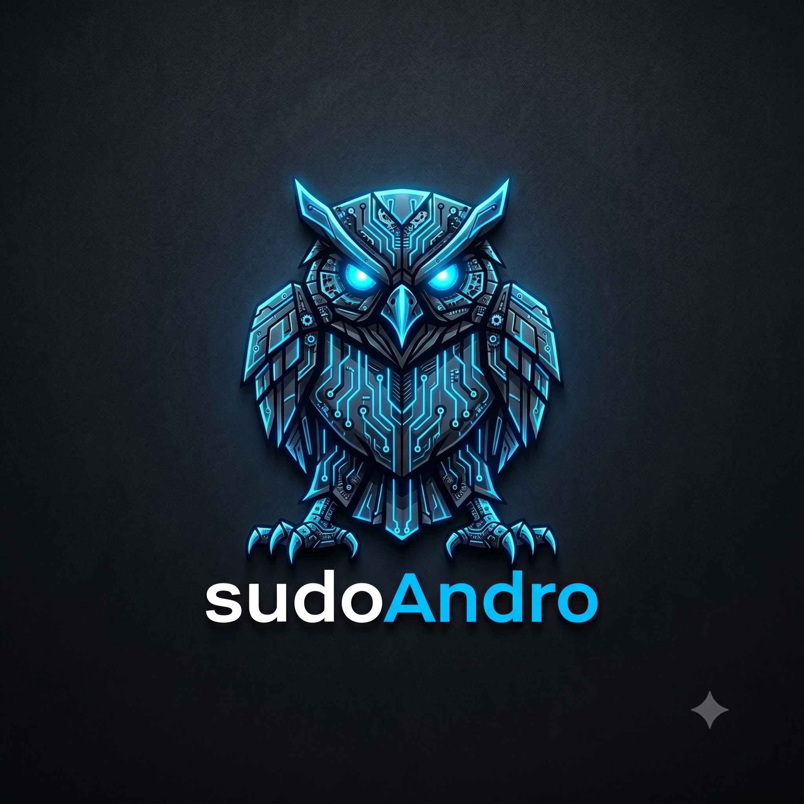

<p align="center">
  
</p>

### `whoami`

</div>

```bash
$ cat /etc/profile.d/andro.sh

NAME="Andrijan Tadic"
ALIAS="sudoAndro"
LOCATION="Solothurn, Switzerland 🇨🇭"
BACKGROUND="20 years CNC Machinist → IT & Cybersecurity"
TRAINING="ICT-Power-User SIZ & Professional SIZ (System & Network) – in progress"
GOAL="Protect people through cybersecurity"
STATUS="Learning every day | Breaking things | Fixing them better"
```

---

## Focus Areas

```
[■■■■■■■■■░]  Windows Administration
[■■■■■■■■░░]  Linux Administration
[■■■■■■░░░░]  Network Security
[■■■■■░░░░░]  Homelab & Virtualization
[■■■░░░░░░░]  Active Directory (in training)
[■■■░░░░░░░]  Secure Application Development (Android)
[■■■░░░░░░░]  Cybersecurity (in progress)
```

---

## Tech Stack

**Operating Systems**


**Windows & Active Directory**


**Virtualization & Infrastructure**


**Networking & Security**


**Services & Tools**


**Mobile Development**


---

## Homelab

A secure homelab architecture centered on OPNsense, with NordVPN/WireGuard, Tailscale mesh connectivity, Pi-hole DNS filtering, and Vaultwarden service hosting.



*This diagram shows the planned secure homelab topology with OPNsense, VPN, DNS filtering, and Tailscale mesh.*

**Key points:**
- OPNsense functions as the WAN gateway, VPN killswitch, firewall, DHCP controller, and Tailscale subnet router.
- Pi-hole handles DNS filtering with Cloudflare/Quad9 upstream resolution.
- Vaultwarden runs in Docker with Caddy TLS and Crowdsec protection.
- Tailscale provides secure overlay access for mobile clients, laptops, and remote management.

*Diagram source: `assets/homelab.mmd`.*

```bash
npm install -g @mermaid-js/mermaid-cli
mmdc -i assets/homelab.mmd -o assets/homelab.svg
```

---

## Featured Projects

| Repository | Description | Status |
|---|---|---|
| [linux-secure-setup](https://github.com/sudoAndro/linux-secure-setup) | Hardening scripts for Debian/Ubuntu | 🟢 Active |
| [samba-nas-setup](https://github.com/sudoAndro/samba-nas-setup) | Samba NAS with Cloudflare Tunnel | 🟢 Active |
| [andro-lab](https://github.com/sudoAndro/andro-lab) | Multi-Layer Cybersecurity Homelab | 🟡 In Progress |
| [proxmox-scripts](https://github.com/sudoAndro/proxmox-scripts) | Automation & setup scripts for Proxmox | 🟢 Active |
| [linux-starter-kit](https://github.com/sudoAndro/linux-starter-kit) | Aliases, tuning & tips for beginners | 🟢 Active |
| [windows-starter-kit](https://github.com/sudoAndro/windows-starter-kit) | Automated PowerShell 7 + Terminal setup | 🟢 Active |
| [active-directory-lab](https://github.com/sudoAndro/active-directory-lab) | Active Directory Lab – Domain Controller, GPOs, DNS Filtering & Logging | 🟢 Active |
| [VaultCalculator](https://github.com/sudoAndro/VaultCalculator) | A fully functional calculator for Android with a private file vault | 🟢 Active |
---

## Roadmap 2025–2026

- [x] Proxmox Homelab aufgebaut
- [x] OPNsense Firewall konfiguriert
- [x] Raspberry Pi – Pi-hole & Samba NAS
- [x] Cloudflare Tunnel eingerichtet
- [x] Active Directory – Windows Server (in Ausbildung)
- [ ] ICT Supporter SIZ abschliessen
- [ ] ICT Professional SIZ abschliessen
- [ ] CompTIA Security+ vorbereiten
- [ ] Erstes CTF (Capture The Flag) abschliessen
- [ ] Cybersecurity Einstiegsposition finden

---

## GitHub Stats

<div align="center">


</div>

---

## Connect

[](https://www.andrijantadic.ch)
[](https://github.com/sudoAndro)

---

<div align="center">

*"The quieter you become, the more you are able to hear."* — Kali Linux


</div>
